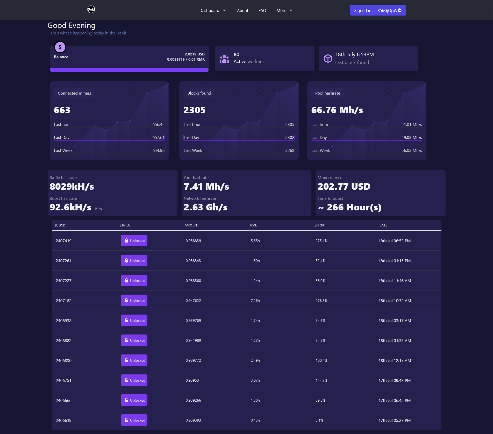

<h1 align="center">Hi 👋, I'm Raymond</h1>
<h3 align="center">I have a Golang addiction.</h3>

- 💼 I’m currently rebuilding my website

- 🌱 I’m currently learning about **linear algebra**

- 🤝 I’m looking to help with [Hackclub](https://hackclub.com)

- 🔥 2023 Goals **Learn machine learning**

<h3>Solidity programming</h4>
I've learnt some solidity skills with brownie, truffle and hardhat however I'm more comfortable with hardhat at this moment.

Wagmi autobond was one of my first solidity open source program however I have private projects that are closed sourced at this time.

This program automates a strategy in the dead Harmony network allowing users to earn the most from their money in the form of yield farming.
- <a href="https://github.com/Crypto-grid/contracts">📈 CryptoGrid</a> A hyper realistic P2E crypto mining simulator on the blockchain made with solidity during Chainlink's spring hackathon
- <a href="https://github.com/provsalt/wagmi-autobond">Wagmi autobond</a>

<h3>Fullstack web development</h3>
- XMRVsBeast

</img>

I used to create a frontend react application closed sourced however I've deleted it since it scaled poorly and nextjs used to be pretty terrible. This is why my 2021 commits are low. This was also my first time giving web development a try.
- <a href="https://github.com/provsalt/beast-oss">Frontend</a> The code looks terrible.
- <a href="https://github.com/provsalt/beast-backend">Backend</a>
  The backend was pretty incomplete since p2pool was released and the pool closed down and there wasn't really much to do since the p2pool community is more active than me lol.

I've also wrote <a href="https://github.com/provsalt/monero-checker">Monero checker</a> which does not work well with webpack because I have never written node packages. But it was mostly copied from . The code was really undocumented and I had to dig up how it worked.

<h3>Game development</h3>
I've never done any game engine stuff but rather touched on backend minecraft server softwares because that was what intrested me back then.

<h4>Dragonfly</h4>
- <a href="https://github.com/provsalt/PM-DF">PM-DF</a> a template dragonfly application with extended commands than the barebones dragonfly ships with.
- <a href="https://github.com/provsalt/economy">Economy </a> is a library to provide a simple single currency with different providers for dragonfly.
  <h4>PocketMine</h4>

- <a href="https://github.com/provsalt/DropParty">DropParty plugin</a> was really impressed when I started coding that I ported an old plugin to the latest API.
- <a href="https://github.com/provsalt/LightningDeath">LightningDeath plugin</a> this was one plugin I worked on since it was on the forums requests and it seemed pretty easy and straight forward. Also supports nukkitx 1.0
- <a href="https://github.com/provsalt/Virus">Virus virion</a> this was a joke virion/library I wrote where developers can inject this virion to their poggitci project code and add a line of code to turn it into a malicious trojan.

[//]: # (

)

[//]: # (
&nbsp;
)

&nbsp;

