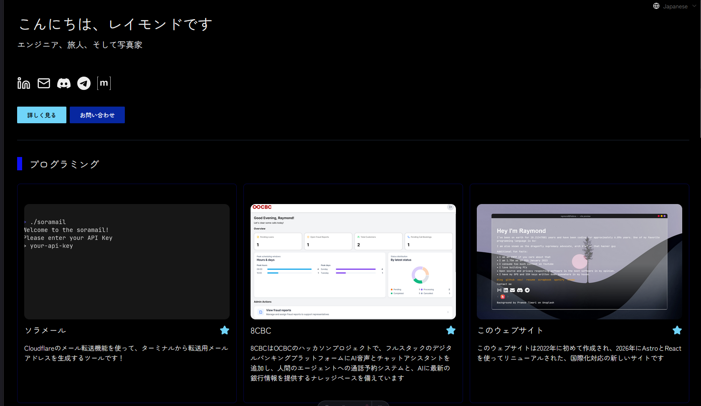

<h1 align="center">Hi 👋, I'm Raymond</h1>
<h3 align="center">I have been working on things outside of coding</h3>

- 💼 I’m currently starting work

- 🤝 Currently looking to work on my own projects

- 🔥 2026 Goals: Build an actual project

<h3>Web development</h3>
- My own website
  </img>

  Built using Astro + React for best performance. Slight regrets of deviating of my Next.js stack but that's ok.

<h3>Game development</h3>
I've never done any game engine stuff but rather touched on backend minecraft server softwares because that was what intrested me back then.

<h4>Dragonfly</h4>
- <a href="https://github.com/provsalt/PM-DF">PM-DF</a> a template dragonfly application with extended commands than the barebones dragonfly ships with.
- <a href="https://github.com/provsalt/economy">Economy </a> is a library to provide a simple single currency with different providers for dragonfly.

[//]: # '

'
[//]: # '

'

