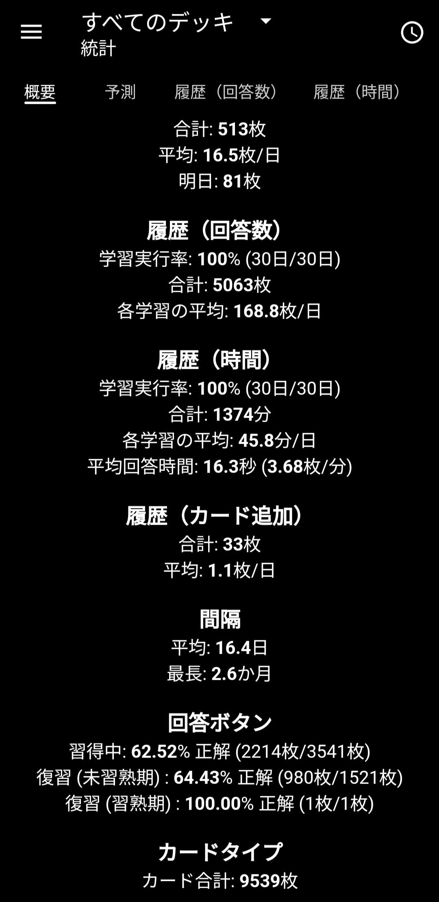
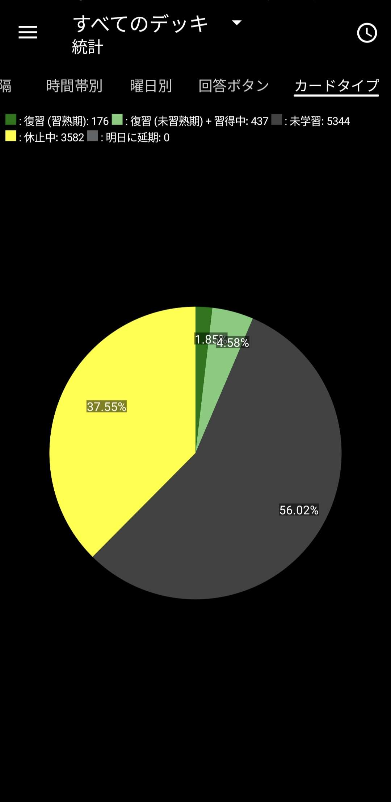

For the past 30 days, I've been studying Japanese every day!

Please correct my Japanese.

## My Japanese adventure😬…

### First week
Katakana sounds like English words. Wow!! Japanese is easy 🙏

When I started learning hiragana and katakana, I thought Japanese was easy; I learned both in just three days.

### Second week
I hate kanji aaah 🤬
I studied Chinese from elementary school through middle school.

However, Japanese is difficult because kanji are pronounced differently in Chinese and Japanese.

### Third week
I watched anime and Japanese dramas. 😜

I neither like nor dislike anime. I watch anime only to study Japanese. That week, I practiced by writing characters.

### This week
I think I'm a little better😭? Lol lol

School was busy, so I haven't studied much Japanese.

I always feel like studying Japanese before doing my school homework, so I think I really do enjoy it.

Next year, I might study Japanese at school.

