import socialNightVideo from "../../../assets/blog/fossasia-2023/social-night.mp4?url";
import socialNightPoster from "../../../assets/blog/fossasia-2023/social-night-poster.jpg?url";

FOSSASIA 2023 からだいたい一週間。やっとこの体験について思ったことを書き出す時間ができた。

## FOSSASIA を知ったきっかけ

正直に言うと、2023年2月より前は FOSSASIA のことを人生で一度も聞いたことがなかった。Sam が Slack で、イベント中に [HackClub](https://hackclub.com) がコミュニティブースを運営するよう招待されたと話していたときに初めて知った！！

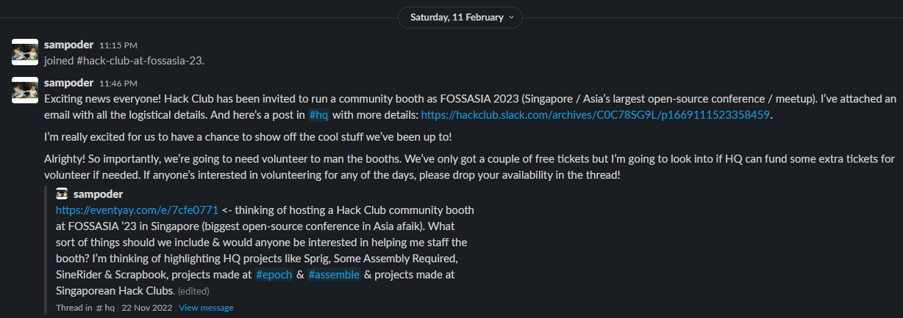

見てみると、いろいろな会社が参加しているし、対面カンファレンスを開くのも久しぶりだったので、一生に一度のチャンスみたいに思えた。すぐに手伝いたいと思った。オープンソースプロジェクトについてもっと学べる絶好の機会だし、FOSSASIA の翌週まで学校が始まらないのもただただ良かったから。

## 準備

4月12日、水曜日。Lifelong Learning Institute（LLI）まで向かった。西に住んでいて東まで行かなきゃいけないときの移動が最高すぎて、一時間以上かかった。びっくりしたことに、Sam はステッカーを持ってきすぎていた。文字どおりステッカー一箱分。信じられなかった。どうにかして大量に配らなきゃいけなかった。

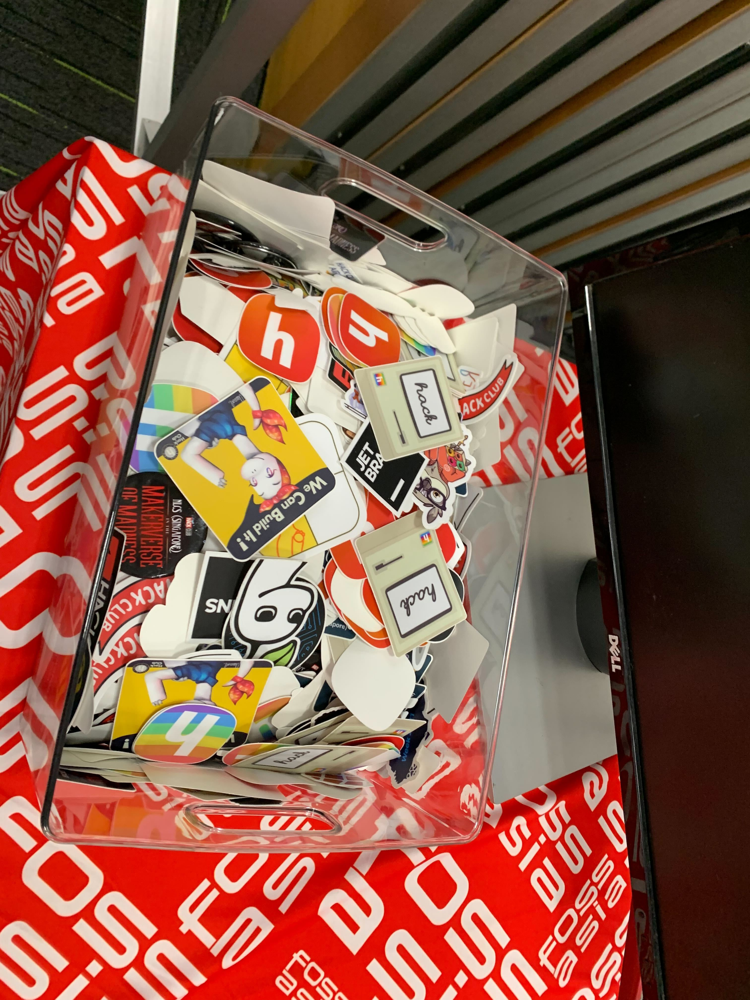

結局、その量のステッカーを入れるために Popular で小さな箱を買うことにした。

配送には時間がかかるので、掲げる HackClub の旗がなかったのは少し残念だった。つまり、かっこいい旗はなし。あったのは HackClub と書かれた紙だけで、ほかのブースと比べるとすごくプロらしくなかった。

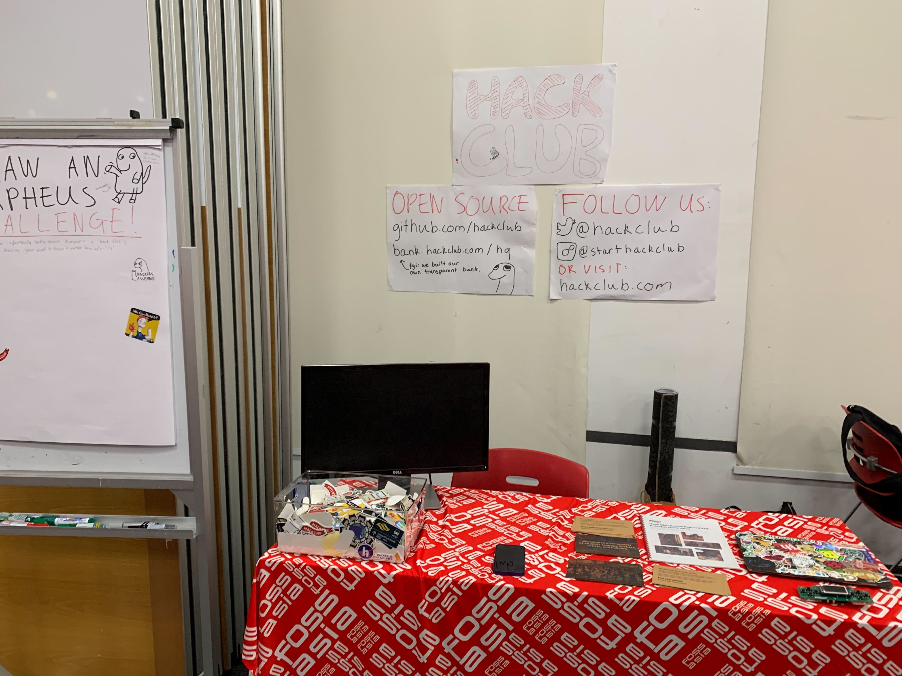

モニターが MacBook で動くようにかなり長いこといじっていたけど、ちらついては「信号なし」に戻るのを延々繰り返すだけだった。もし動かなかったら、Sam が何のために持ってきたのかって感じで本当に残念だった。

## 1日目

もちろん少し遅れて来た。次の数日も同じ傾向になる。東まで行って誰もいないのを見るためだけに、朝6時に起きるわけがない。今回は部屋の隅に放り込まれていた小さな Fedora PLD（ミニサーバーとして使っていたやつ）と HDMI ケーブルを持ってきた。モニターが問題なく動いたときは本当に嬉しかった。これでようやく、こんな感じのスクラップブック TV 的なものを表示できる。

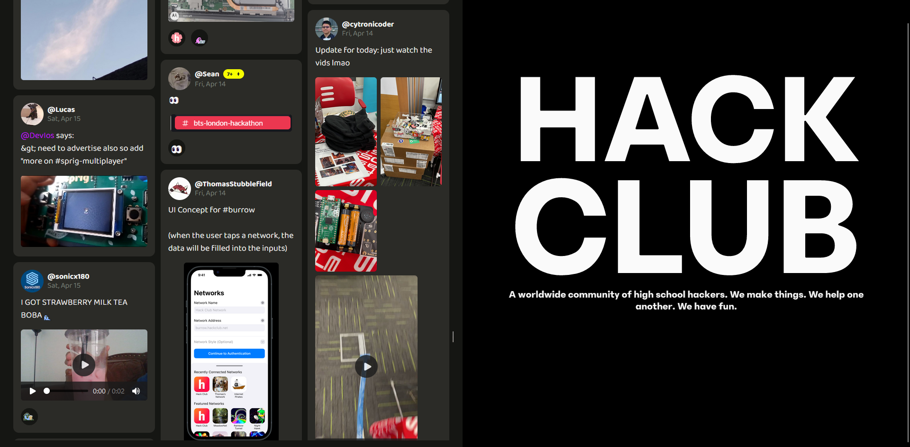

1日目はすごかった。人通りがめちゃくちゃ多くて、HackClub が何なのか聞いてくる人がたくさんいたし、子どもの学校で HackClub を始めようと決めた親御さんもいて、これは本当にすごい！

## 2日目

前の晩に osu! をやってコードを書こうという最悪の判断をしたせいで、また遅れた。でも大丈夫、いちばん遅いわけじゃなかった。実際には、いちばん早かった。

で、何のコードを書いていたのかと聞かれるかもしれない。[HackClub place](https://place.hackclub.com)[^1] を完全に破壊するコードだ。キャンバスをめちゃくちゃにして、皆がピクセルを描くのに費やした時間を台無しにしたので、コミュニティの半分を怒らせた。r/placemonero 用のボットを作った経験があったので、また10分でプロトタイプを作った。サーバーにレート制限がなかったから、めちゃくちゃうまく動いた。

できたからというだけで、キャンバス全体に osu のロゴを描いた。

まあ Place の話はさておき、予想より人が少なかったので、ブースで全然こっそりとは言えない osu! を少しやった。金曜日だから昼を過ぎればもっと人が来ると思っていたのに。

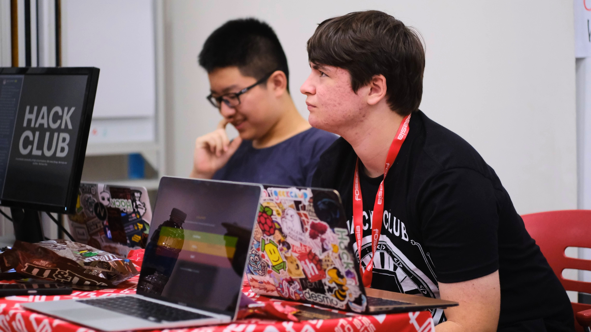

それ以外の時間は、ほとんど BuildingBlocs のブースでほかの学生たちと過ごしていた。その直後に僕も彼らのコミュニティに参加した。

### ソーシャルイベント（午後6時以降）

そこにいた人の多さに驚いた。僕たちはほとんどの時間をビーチルームで食べて過ごした。そこにはオープンソースのカラオケアプリ https://mixxx.org/ を開いたノートPCもあって、どう見ても怪しい（もちろん絶対に海賊版ではない）音楽が流れていた！

<video
  controls
  playsInline
  preload="metadata"
  src={socialNightVideo}
  poster={socialNightPoster}
>
  お使いのブラウザはソーシャルイベントの動画に対応していません。
</video>

_絶対に海賊版ではない音楽で楽しむ、ソーシャルイベントのカラオケセットアップ。_

認めると、僕の歌はひどい。でも長くて疲れる一日のあとに楽しんでいるなら、それでいい。

イベント中に写真も撮った。そして……誰がいないか分かる？ Arashだ！

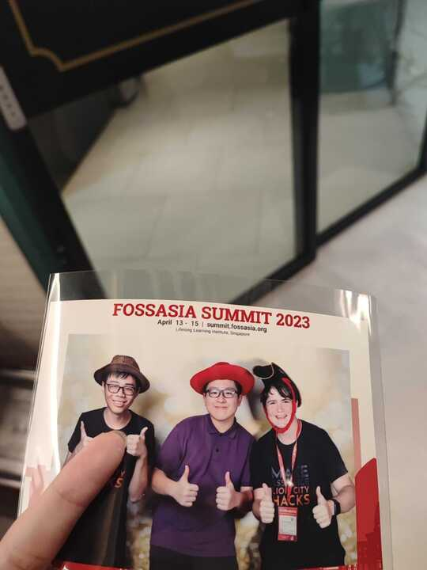

やっと！ 2日目が終わって、ベッドに入ったのは午前0時だった。

## 3日目

2日目と同じく、もうブースの周りに来る人はあまりいなかったので、僕たちのほとんどはブースを放棄して、もっといろいろな人と交流しに行った。

その日、Sam は HackClub と、オープンソースが HackClub 全体にとってどれほど革新的だったかについてライトニングトークもした。僕が撮った動画へのリンクはこれ：https://www.youtube.com/watch?v=afwQkr5UHpE。

えーと、昨日と同じく、今日こそ来ると思っていたお気に入りの HackClubber、Arash 抜きで 360度写真を撮りに行った。3Dモデルもすぐレンダリングされるはず。たぶん。

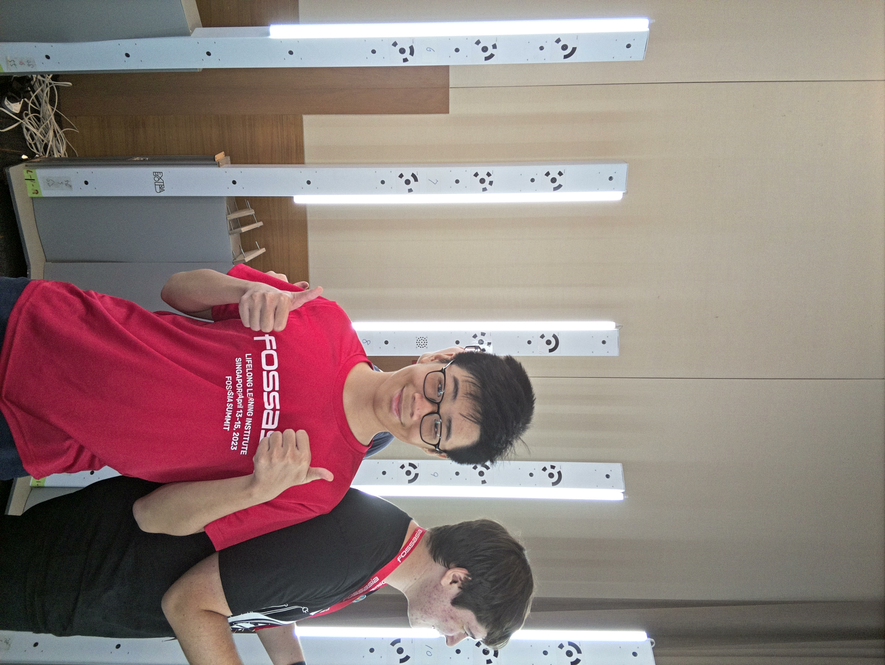

さてさて、これで FOSSASIA 2023 の僕の時間はだいたい終わり。片付ける前に、みんなが僕たちの素晴らしい紙に描いてくれた「Orpheus」を何枚か撮った。

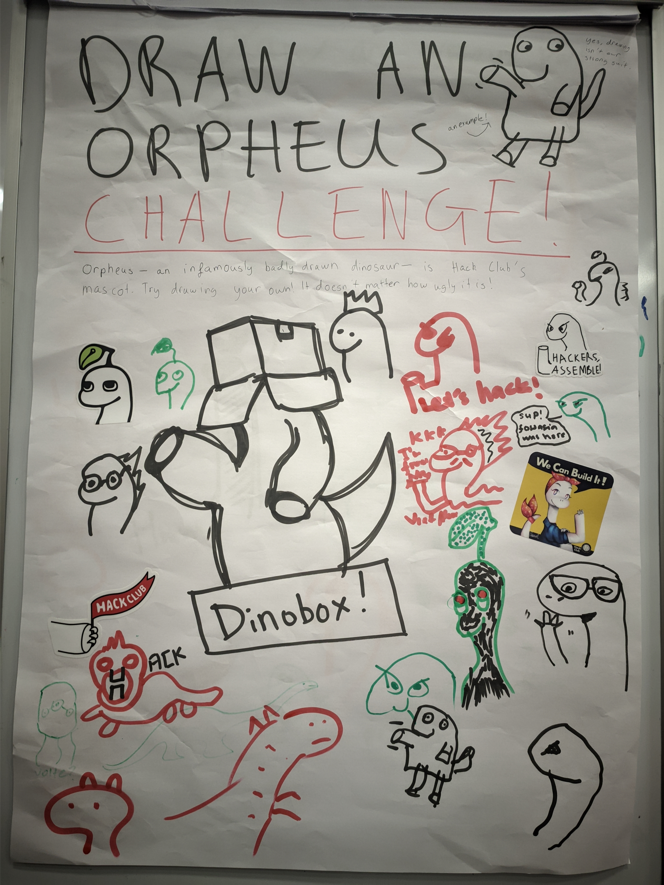

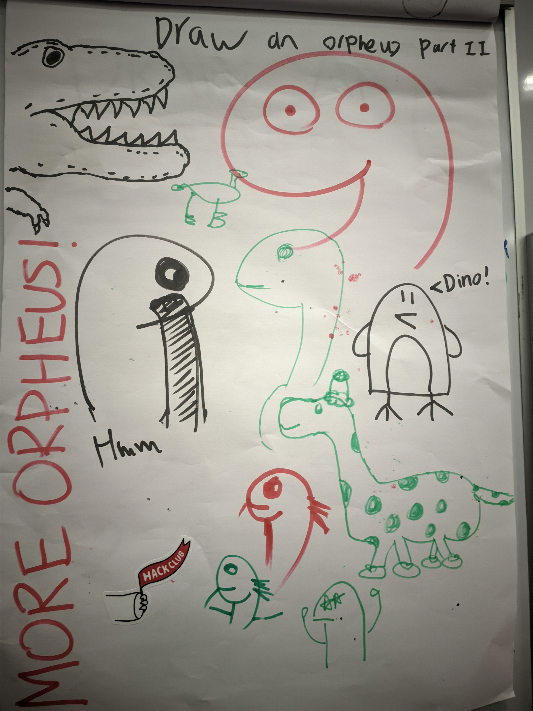

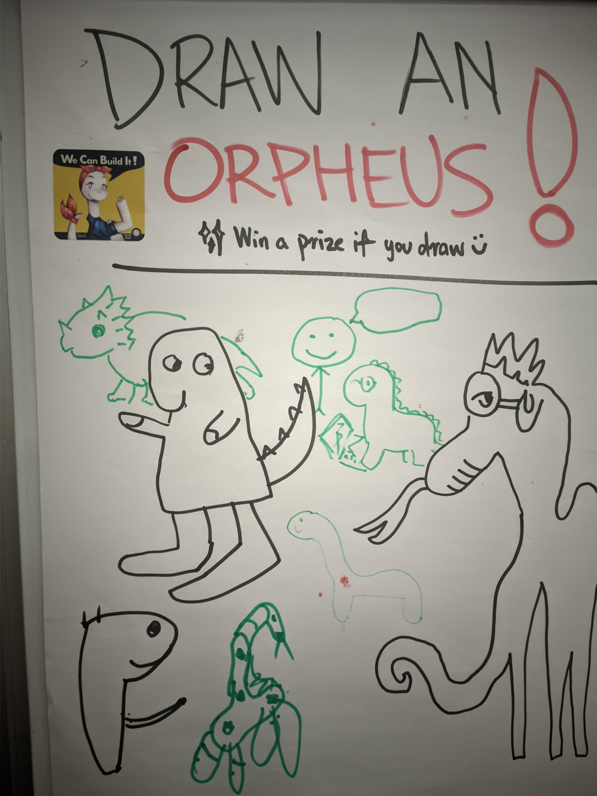

あ、それと、BuildingBlocsの友だちを~~無理やり~~DinoBoxにした。

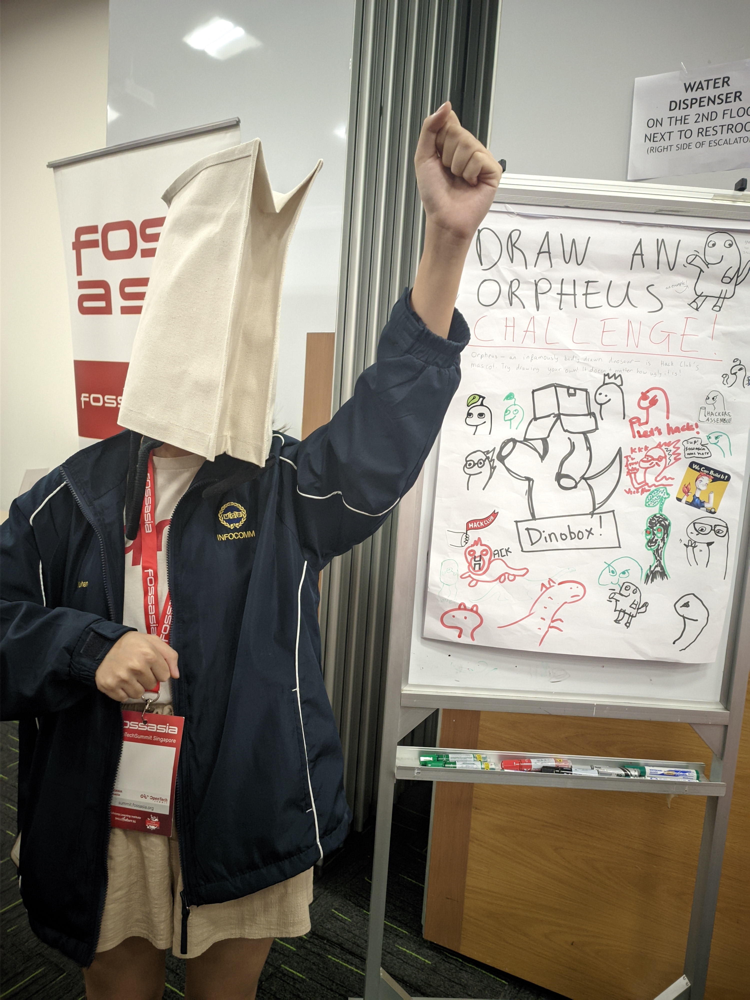

## まとめ

全体として、これは本当にユニークな体験だった。実際の会社にいたら得られなかったような、あまり堅苦しくないコミュニティブースで仲間と交流しながら、この分野のたくさんのプロにも会えた。スワッグも大量にもらった。何年にもわたってもらった無料の服でクローゼットがいっぱいになる開発者にとって、それはいつだってありがたい！ FOSSASIA 2024 にも参加して、僕の考えと目標が一致している BuildingBlocs の人たちを手伝えるのを楽しみにしている。

[^1]: HackClub Place は、2017年と2022年に行われた r/place イベントに着想を得ている。
