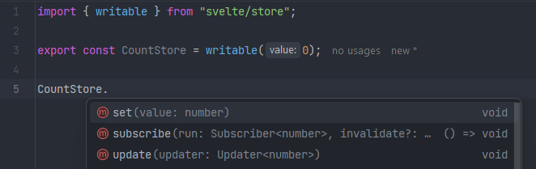

さて、まずはじめに。このブログへようこそ。誰も読まないようなランダムなことについて話す場所です。

## で... sveltekitってどうなの？

sveltekitはほとんど純粋なハイプみたいなものですが、個人的にはその評判に見合うと思いましたし、このフレームワークが大好きです。とても高速なviteも使っているので、パフォーマンスと速度の両方でreactよりずっと優れています。最近sveltekitがベータ版を卒業したので、ポートフォリオを完全にsvelteとtypescriptで書くことにしました。ここでは、私が気に入っている点をいくつか紹介します。

## Svelteはシンプル

私にとってreactはシンプルに感じていました。でも、htmlの知識がある初心者にreactを学んでもらおうとしてみた結果、言っておきますが、私は間違っていました。一方でsvelteは、react domや混乱する抽象化だらけのjsxではなく、本当にHTMLを書いているように感じます。svelteなら、とにかく動きます。何かあっても、よく整備されたドキュメントを見ればいいだけです。

## Svelteのストアは最高

組み込みのuseState()、useContext()、あるいはreduxまで、どう使えばいいか悩む時代は終わりました。ストア、リデューサーなどの、あの面倒なボイラープレートコードは、文字どおりsvelteに組み込まれています。Reactにはそれがありませんし、useContextもproviderと一緒に使うと、なんとなくstateを使うことになります。

Svelteなら、そんな苦痛は数行のコードで解決します！

あまりにも簡単すぎて、どうして他のフレームワークがまだこれを盗んでいないのか不思議です...

## 結論

svelteにはたくさんのクールな機能があるのは本当ですが、+page.svelteという命名規則など、いくつか気になった欠点もあります。今どのページで作業しているのかが明確ではありません。複数の開発者が大規模なアプリケーションに取り組んでいる場合を想像してみてください。コードが誤って別のページに紛れ込んでしまう可能性があります。
全体として、svelteが提供してくれるものには満足しています。これまでsolid-start、nextjs、そして今回はsvelteで、ウェブサイトを3回書き直してきました。このウェブサイトの仕上がりには本当に満足していますし、これから取り組む新しいプロジェクトでも、間違いなくsvelteを使い続けます。
